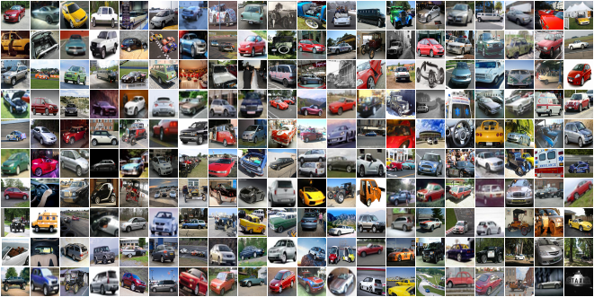
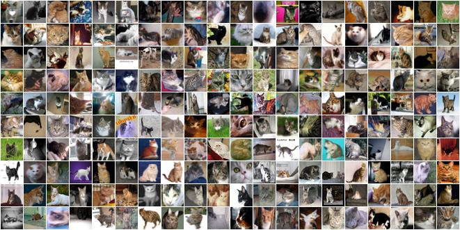
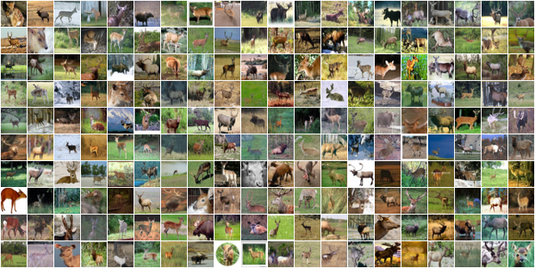
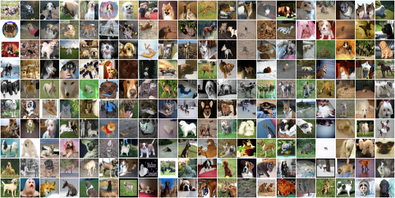
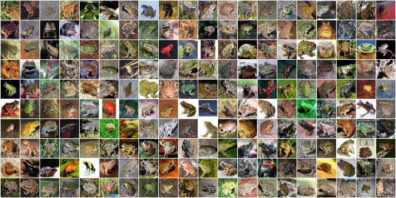
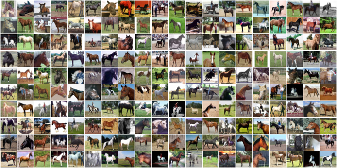
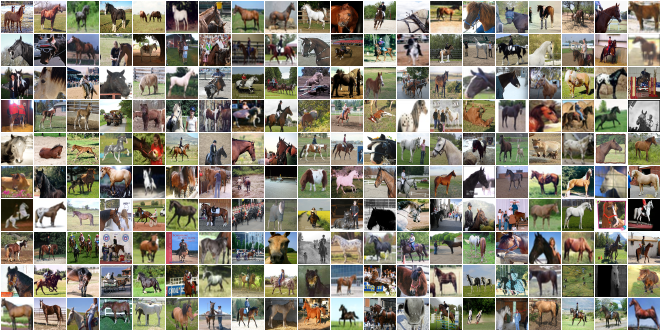
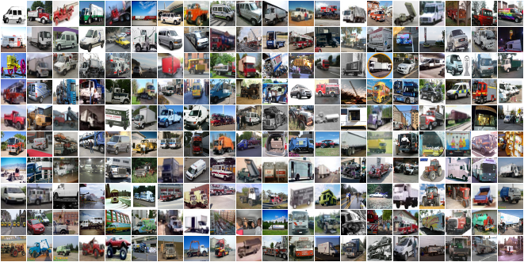

# CINIC-10: CINIC-10 Is Not Imagenet or CIFAR-10
... but it is created therefrom.

## Purpose
To understand the purpose of compiling CINIC-10, consider the following:
- [CIFAR-10](https://www.cs.toronto.edu/~kriz/cifar.html) is a commonly used benchmarking image dataset.
- It would be advantageous to have an extended version of CIFAR-10 since 6000 samples per class is not always sufficient for deep learning tasks, or the computation of information theoretic quantities. 
- [The Fall 2011 ImageNet release](http://www.image-net.org/) contains images within the same classes as CIFAR-10.
- The gap in task-difficulties when training models using CIFAR-10 and CIFAR-100 is considerable, and more so the gap between these and models trained using ImageNet data.
- A dataset that provides another milestone with regards to difficulty would be useful.
- [ImageNet32x32 and ImageNet64x64](https://arxiv.org/abs/1707.08819) are downsampled versions of the ILSVRC ImageNet standard release. This certainly provides a milestone in that the image sizes are identical to CIFAR. However, this poses a *more challeging problem* than that of the original ImageNet data: the downsampled images have substantially less capacity for information. 
- Some tasks - such as information theoretic analysis of deep learning - would be better suited to data-splits (train/validation/test, for example) that are equal. To create such a split requires more data than what is available in CIFAR-10 (and CIFAR-100)
- Equally sized train-, validation-, and test-subsets give a more principled perspective of generalization performance.

CINIC-10, *cynically minded pun regarding relatively longstanding benchmarking datasets only mildly intended and notwithstanding*, is constructed in such a way that it provides the same challenges as CIFAR-10 (regarding higher level descriptions - 10-way classification, for instance) but has more data for training, validation, and testing.

## Details

- CINIC-10 has a total of 270,000 images equally split amonst three subsets: train, validate, and test. This means that CINIC-10 has 4.5 times as many samples than CIFAR-10. 

- In each subset (90,000 images) there are ten classes (identical to [CIFAR-10](https://www.cs.toronto.edu/~kriz/cifar.html) classes). There are 9000 images per class per subset. Using the suggested data split (an equal three-way split), CINIC-10 has 1.8 times as many training samples than CIFAR-10. CINIC-10 is designed to be directly swappable with CIFAR-10.

- The train and validation classes can be combined to form a larger train set. In this case, CINIC-10 would have 3.6 times as many training samples than CIFAR-10. A [notebook is provided](notebooks/enlarge-train-set.ipynb) to do this.

- The means and standard deviations of the (*r*,*g*,*b*) channels was calculated to be:

  ```python
  cinic_mean_RGB = [0.47889522, 0.47227842, 0.43047404]
  cinic_std_RGB = [0.24205776, 0.23828046, 0.25874835]
  ```

- CINIC-10 is saved to be [used with PyTorch data loaders](#data-loading). The following folder structure is used:

    train/

    train/airplane

    train/automobile

    train/...

    valid/

    valid/...

    test/

    test/...

## Benchmarks

Bechmarks were run on CINIC-10 in two configurations: (1) the suggested equal three-way split, trained on the train subset and tested on the test subset; and (2) trained on the combined train and validation sets, and tested on the test set. 

Model definitions were copied from [here](https://github.com/kuangliu/pytorch-cifar/). They were all trained for 300 epochs, at an initial learning rate of 0.1, with a momentum multiplier of 0.9, weight decay with a multiplier of 0.0001, and batch size 64. The learning rate was cosine annealed to zero.

#### Results when training on the train subset

| Model              | No. Parameters |  Validation Error  |
|--------------------|----------------|--------------------|
| VGG-16             |  14.7M         | 15.25              |
| ResNet-18          |  11.2M         | 12.42              |
| ResNet-18 (preact) |  11.2M         | 12.84              |
| GoogLeNet          |   6.2M         | 11.54              |
| ResNeXt29_2x64d    |   9.2M         | 11.66              |
| Mobilenet          |   3.2M         | 19.55              |

### Results when training on the train + validation subset

For comparison with CIFAR-10 models, these were trained 5 times with different seeds. The error is listed to include standard deviation over those runs:

| Model              | No. Parameters |  Validation Error  |
|--------------------|----------------|--------------------|
| VGG-16             |  14.7M         | 12.23 +/- 0.16     |
| ResNet-18          |  11.2M         |  9.73 +/- 0.05     |
| ResNet-18 (preact) |  11.2M         | 10.10 +/- 0.08     |
| GoogLeNet          |   6.2M         |  8.83 +/- 0.12     |
| ResNeXt29_2x64d    |   9.2M         |  8.55 +/- 0.15     |
| Densenet-121       |   7.0M         |  8.74 +/- 0.16     |
| Mobilenet          |   3.2M         | 18.00 +/- 0.16     |


## Construction
1. The original CIFAR-10 data was processed into image format (.png) and stored as follows:
      ``` [$set$/$class_name$/cifar-10-$origin$-$index$.png]```

      - where ```$set$``` is either train, valid or test. ```$class_name$``` refers to the [CIFAR-10 classes](https://www.cs.toronto.edu/~kriz/cifar.html) (airplane, automobile, etc.), ```$origin$``` the set from which the image was taken (train or test), and ```$index$``` the original index of this images within the set it comes from. 
      - **NOTES**:
           - Storing in this manner enables the user to perfectly reconstruct the CIFAR-10 dataset from CINIC-10. We have provided [a notebook](notebooks/recover-cifar-and-validate.ipynb)  that demonstrates how to do this and validates that the images are identical.
           - The entirety of the original CIFAR-10 *test* set is within the abovementioned *new* *test* set. The remaining elements of this *new test* set were randomly selected from the CIFAR-10 train set. The *new* train and validation sets are a random split of the remaining elements therein.

         This is an equal split of the CIFAR-10 data: 20000 images per set; 2000 images per class within set; and an equal distribution of CIFAR-10 data among all three sets.

2. The relevant synonym sets (synsets) within the Fall 2011 release of the ImageNet Database were identified and collected. These *synset-groups* are listed in [**synsets-to-cifar-10-classes.txt**](synsets-to-cifar-10-classes.txt). The mapping from sysnsets to CINIC-10 is listed in [**imagenet-contributors.csv**](imagenet-contributors.csv) 

3. These synsets were downloaded using [Imagenet Utils](https://github.com/tzutalin/ImageNet_Utils). Note that some *.tar* downloads failed (with a 0 Byte download) even after repeated retries. This is not exceedingly detrimental as a subset of the downloaded images was taken.

4. The *.tar* files were extracted, the *.JPEG* images were read using the Pillow Python library, and converted to 32 by 32 pixel images with the 'Box' algorithm from the [Pillow library](https://python-pillow.org) (in the same manner as [Imagenet32x32](https://patrykchrabaszcz.github.io/Imagenet32/), for consistency).

5. The **lowest** number of CIFAR10 **class-relevant** samples from these Imagenet *synset-groups* samples was observed to be 21939 in the 'truck' class. Therefore, 21000 samples were randomly selected from each *synset-group* to compile CINIC-10 by augmenting the CIFAR-10 data.

6. Finally, these 21000 samples were randomly distributed (but can be recovered using the filename) within the *new* train, validation, and test sets, storing as follows:
      ``` [$set$/$class_name$/$synset$_$number$.png]```

      - where ```$set$``` is either train, valid or test. ```$class_name$``` refers to the [CIFAR-10 classes](https://www.cs.toronto.edu/~kriz/cifar.html) (airplane, automobile, etc.). ```$synset$``` indicates which Imagenet synset this image came from and ```$number$``` is the image number directly associated with the original *.JPEG* images. 
      - **NOTES**:
           - The image filenames themselves, ```$synset$_$number$.png```, are identical to the filenames of the original *.JPEG* images from which these downsampled *.png* images were computed. 
           - This naming structure allows the user to identify exactly the origin of all images. 

7. The result is a dataset that consists of **270000 images** (60000 from the original CIFAR-10 data and the remaining from Imagenet), split into three equal-sized train, validation, and test subsets. Thus, each class within these subsets contains 9000 images. 

## Usage

### Download

TODO

### Data loading

The simplest way to use CINIC-10 is with a [PyTorch](https://pytorch.org/) data loader, as follows:

``` python
import torchvision
import torchvision.transforms as transforms

cinic_directory = '/path/to/cinic/directory'
cinic_mean = [0.47889522, 0.47227842, 0.43047404]
cinic_std = [0.24205776, 0.23828046, 0.25874835]
cinic_train = torch.utils.data.DataLoader(
    torchvision.datasets.ImageFolder(cinic_directory + '/train',
    	transform=transforms.Compose([transforms.ToTensor(),
        transforms.Normalize(mean=cinic_mean,std=cinic_std)])),
    batch_size=128, shuffle=True)
```

### Classification
The suggested dataset can be used *as is* in a standard classification set-up. Further, the train and validation subsets can be combined ([using symbolic links, into a new data folder](notebooks/enlarge-train-set.ipynb))  to more closely match the data split choice of CIFAR-10 (one large train set, and one smaller test set).

### Distribution shift

Since CINIC-10 is constructed from two different sources, it is not a guarantee that the constituent elements are drawn from the same distribution. This is one of the motivations for an equal split of the CIFAR-10 data between each subset of CINIC-10. This property can, however, be leveraged to understand how well models cope with samples drawn from similar but not identical distributions. A [notebook](notebooks/imagenet-extraction.ipynb) is provided to extract the imagenet samples from CINIC-10, and [another](notebooks/cifar-extraction.ipynb) to extract the CIFAR-10 samples. 

## Samples
Below are samples randomly selected from CINIC-10 and from CIFAR-10 for comparison. It is clear that CINIC-10 is a more noisy dataset because the *Imagenet constituent samples were not vetted*.


### Airplane

##### CIFAR-10


##### CINIC-10


---


### Automobile

##### CIFAR-10


##### CINIC-10


---

### Bird

##### CIFAR-10


##### CINIC-10


---

### Cat

##### CIFAR-10


##### CINIC-10


---

### Deer

##### CIFAR-10


##### CINIC-10


---

### Dog

##### CIFAR-10


##### CINIC-10


---

### Frog

##### CIFAR-10


##### CINIC-10


---
### Horse

##### CIFAR-10


##### CINIC-10


---

### Ship

##### CIFAR-10


##### CINIC-10


---

### Truck

##### CIFAR-10


##### CINIC-10


---

## Pixel intensity distribution

The figure below compares the intensity distributions of Imagenet contributors and CIFAR-10. The dashed lines are the means.


