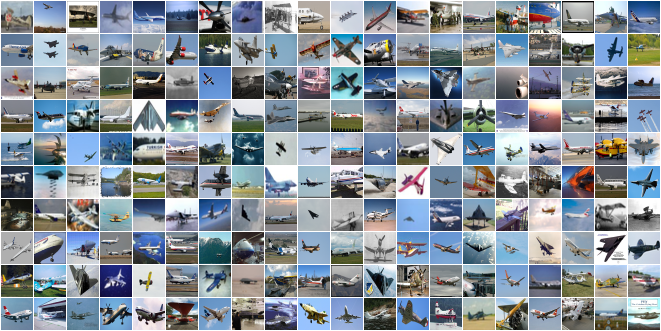
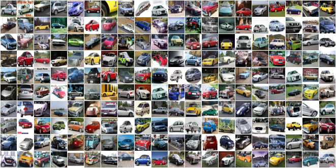
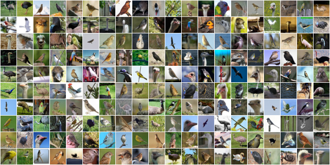
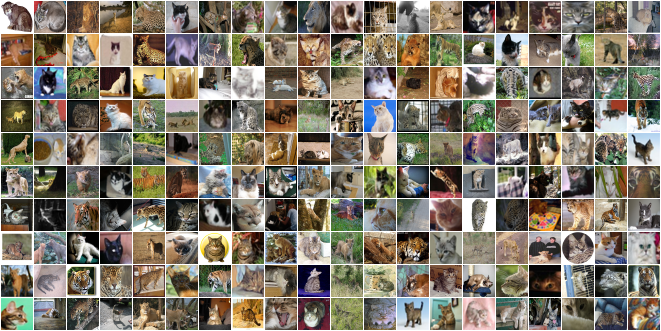
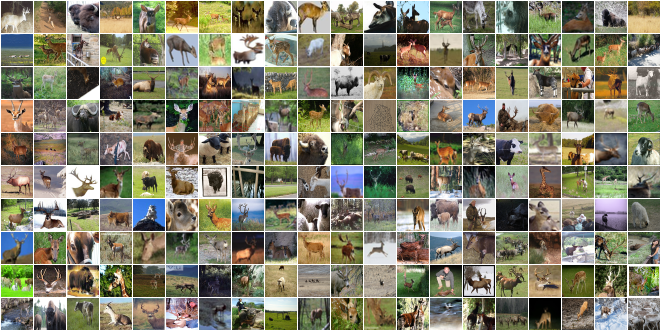
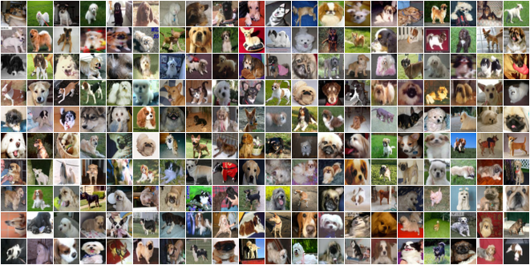
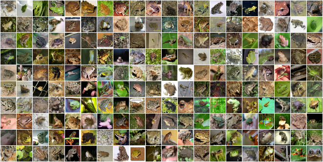
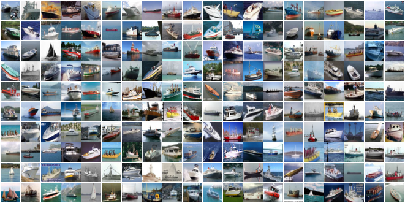
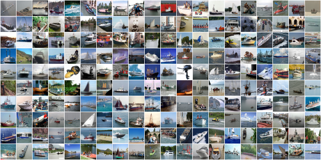
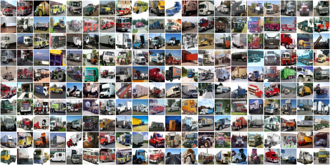

# CINIC-10: CINIC-10 Is Not Imagenet or CIFAR-10
Benchmarking, Papers with code: [https://paperswithcode.com/sota/image-classification-on-cinic-10](https://paperswithcode.com/sota/image-classification-on-cinic-10)

Dataset: [http://dx.doi.org/10.7488/ds/2448](http://dx.doi.org/10.7488/ds/2448)

Blog: [Bayeswatch Blog: CINIC-10](http://www.bayeswatch.com/2018/10/09/CINIC/)

Paper: [Darlow L.N., Crowley E.J., Antoniou A., and A.J. Storkey (2018) CINIC-10 is not ImageNet or CIFAR-10. Report EDI-INF-ANC-1802 (arXiv:1810.03505).](https://arxiv.org/abs/1810.03505)

CINIC-10 is a drop-in replacement for CIFAR-10. We compiled it as a benchmarking datset because CIFAR-10  can be too small/too easy and ImageNet is often too large/difficult. [ImageNet32](https://arxiv.org/abs/1707.08819) and [ImageNet64](https://arxiv.org/abs/1707.08819) are smaller than ImageNet but even more difficult. CINIC-10 fills this benchmarking gap. 

## Motivation
"Recent years have seen tremendous advances in the field of deep learning ([LeCun et al., 2015](#references))"


Some derivation of the quote above may be familiar to many readers. Something similar appears at the beginning of numerous papers on deep learning. How might we assess statements like this? It is through benchmarking. AlexNet ([Krizhevsky et al., 2012](#references)) outperformed traditional computer vision methods on ImageNet ([Russakovsky et al., 2015](#references)), which was in turn outperformed by VGG nets ([Simonyan & Zisserman, 2015](#references)), then ResNets ([He et al., 2016](#references)) etc.

ImageNet has its flaws however. It is an unwieldy dataset. The images are large, at least in neural network terms, and there are over a million of them. A single training run can take several days without abundant computational resources ([Goyal et al., 2017](#references)). Perhaps for this reason, CIFAR-10 and CIFAR-100 ([Krizhevsky, 2009](#references)) have become the datasets of choice for many when initially benchmarking neural networks in the context of realistic images. Indeed, this is where several popular architectures have demonstrated their potency ([Huang et al., 2017](#references); [Gastaldi, 2017](#references)).

In CIFAR-10, each of the 10 classes has 6,000 examples. The 100 classes of CIFAR-100 only have 600 examples each. This leads to a large gap in difficulty between these tasks; CIFAR-100 is arguably more difficult than even ImageNet. A dataset that provides another milestone with respect to task difficulty would be useful. ImageNet-32 ([Chrabaszcz et al., 2017](#references)) already exists as a CIFAR alternative; however, this actually poses a more challenging problem than ImageNet as the down-sampled images have substantially less capacity for information. Moreover, most benchmark datasets have uneven train/validation/test splits (validation being non-existent for CIFAR). Equally sized splits are desirable, as they give a more principled perspective of generalisation performance.

To combat the shortcomings of existing benchmarking datasets, we present CINIC-10: CINIC-10 Is Not ImageNet or CIFAR-10. It is an extension of CIFAR-10 via the addition of downsampled ImageNet images. CINIC-10 has the following desirable properties:
- It has 270,000 images, 4.5 times that of CIFAR.
- The images are the same size as in CIFAR, meaning that CINIC-10 can be used as a drop-in
alternative to CIFAR-10. 
- It has equally sized train, validation, and test splits. In some experimental setups it may be that more than one training dataset is required. Nonetheless, a fair assessment of generalisation performance is enabled through equal dataset split sizes. 
- The train and validation subsets can be combined to make a larger training set. 
- CINIC-10 consists of images from both CIFAR and ImageNet. The images from these are not necessarily identically distributed, presenting a new challenge: distribution shift. In other words, we can find out how well models trained on CIFAR images perform on ImageNet images for the same classes.

## Details

- CINIC-10 has a total of 270,000 images equally split amonst three subsets: train, validate, and test.

- In each subset (90,000 images) there are ten classes (identical to [CIFAR-10](https://www.cs.toronto.edu/~kriz/cifar.html) classes). There are 9,000 images per class per subset. Using the suggested data split (an equal three-way split), CINIC-10 has 1.8 times as many training samples than CIFAR-10. CINIC-10 is designed to be directly swappable with CIFAR-10.

- The train and validation classes can be combined to form a larger train set. In this case, CINIC-10 would have 3.6 times as many training samples than CIFAR-10. A [notebook is provided](https://github.com/BayesWatch/cinic-10/blob/master/notebooks/enlarge-train-set.ipynb) to do this.

- The means and standard deviations of the (*r*,*g*,*b*) channels was calculated to be:

  ```python
  cinic_mean_RGB = [0.47889522, 0.47227842, 0.43047404]
  cinic_std_RGB = [0.24205776, 0.23828046, 0.25874835]
  ```

- CINIC-10 is saved to be [used with PyTorch data loaders](#data-loading). The following folder structure is used:

    train/

    train/airplane

    train/automobile

    train/...

    valid/

    valid/...

    test/

    test/...
    
## Construction
1. The original CIFAR-10 data was processed into image format (.png) and stored as follows:
      ``` [$set$/$class_name$/cifar-10-$origin$-$index$.png]```

      - where ```$set$``` is either train, valid or test. ```$class_name$``` refers to the [CIFAR-10 classes](https://www.cs.toronto.edu/~kriz/cifar.html) (airplane, automobile, etc.), ```$origin$``` the set from which the image was taken (train or test), and ```$index$``` the original index of this images within the set it comes from. 
      - **NOTES**:
           - Storing in this manner enables the user to perfectly reconstruct the CIFAR-10 dataset from CINIC-10. We have provided [a notebook](https://github.com/BayesWatch/cinic-10/blob/master/notebooks/recover-cifar-and-validate.ipynb)  that demonstrates how to do this and validates that the images are identical.
           - The entirety of the original CIFAR-10 *test* set is within the abovementioned *new* *test* set. The remaining elements of this *new test* set were randomly selected from the CIFAR-10 train set. The *new* train and validation sets are a random split of the remaining elements therein.

         This is an equal split of the CIFAR-10 data: 20000 images per set; 2000 images per class within set; and an equal distribution of CIFAR-10 data among all three sets.

2. The relevant synonym sets (synsets) within the Fall 2011 release of the ImageNet Database were identified and collected. These *synset-groups* are listed in [**synsets-to-cifar-10-classes.txt**](https://github.com/BayesWatch/cinic-10/blob/master/synsets-to-cifar-10-classes.txt). The mapping from sysnsets to CINIC-10 is listed in [**imagenet-contributors.csv**](https://github.com/BayesWatch/cinic-10/blob/master/imagenet-contributors.csv) 

3. These synsets were downloaded using [Imagenet Utils](https://github.com/tzutalin/ImageNet_Utils). Note that some *.tar* downloads failed (with a 0 Byte download) even after repeated retries. This is not exceedingly detrimental as a subset of the downloaded images was taken.

4. The *.tar* files were extracted, the *.JPEG* images were read using the Pillow Python library, and converted to 32 by 32 pixel images with the 'Box' algorithm from the [Pillow library](https://python-pillow.org) (in the same manner as [Imagenet32x32](https://patrykchrabaszcz.github.io/Imagenet32/), for consistency).

5. The **lowest** number of CIFAR10 **class-relevant** samples from these Imagenet *synset-groups* samples was observed to be 21939 in the 'truck' class. Therefore, 21,000 samples were randomly selected from each *synset-group* to compile CINIC-10 by augmenting the CIFAR-10 data.

6. Finally, these 21,000 samples were randomly distributed (but can be recovered using the filename) within the *new* train, validation, and test sets, storing as follows:
      ``` [$set$/$class_name$/$synset$_$number$.png]```

      - where ```$set$``` is either train, valid or test. ```$class_name$``` refers to the [CIFAR-10 classes](https://www.cs.toronto.edu/~kriz/cifar.html) (airplane, automobile, etc.). ```$synset$``` indicates which Imagenet synset this image came from and ```$number$``` is the image number directly associated with the original *.JPEG* images. 
      - **NOTES**:
           - The image filenames themselves, ```$synset$_$number$.png```, are identical to the filenames of the original *.JPEG* images from which these downsampled *.png* images were computed. 
           - This naming structure allows the user to identify exactly the origin of all images. 


## Benchmarks

Bechmarks were run on CINIC-10 in two configurations: (1) the suggested equal three-way split, trained on the train subset and tested on the test subset; and (2) trained on the combined train and validation sets, and tested on the test set. 

Model definitions were copied from [here](https://github.com/kuangliu/pytorch-cifar/). They were all trained for 300 epochs, at an initial learning rate of 0.1, with a momentum multiplier of 0.9, weight decay with a multiplier of 0.0001, and batch size 64. The learning rate was cosine annealed to zero.

#### Results when training on the train subset

| Model              | No. Parameters |  Validation Error  |
|--------------------|----------------|--------------------|
| VGG-16             |  14.7M         | 15.25              |
| ResNet-18          |  11.2M         | 12.42              |
| ResNet-18 (preact) |  11.2M         | 12.84              |
| GoogLeNet          |   6.2M         | 11.54              |
| ResNeXt29_2x64d    |   9.2M         | 11.66              |
| Mobilenet          |   3.2M         | 19.55              |

### Results when training on the train + validation subset

For comparison with CIFAR-10 models, these were trained 5 times with different seeds. The error is listed to include standard deviation over those runs:

| Model              | No. Parameters |  Validation Error  |
|--------------------|----------------|--------------------|
| VGG-16             |  14.7M         | 12.23 +/- 0.16     |
| ResNet-18          |  11.2M         |  9.73 +/- 0.05     |
| ResNet-18 (preact) |  11.2M         | 10.10 +/- 0.08     |
| GoogLeNet          |   6.2M         |  8.83 +/- 0.12     |
| ResNeXt29_2x64d    |   9.2M         |  8.55 +/- 0.15     |
| Densenet-121       |   7.0M         |  8.74 +/- 0.16     |
| Mobilenet          |   3.2M         | 18.00 +/- 0.16     |


## Usage

### Download

To download either [use this link](https://datashare.is.ed.ac.uk/handle/10283/3192) or the following wget command:

```bash
wget https://datashare.is.ed.ac.uk/bitstream/handle/10283/3192/CINIC-10.tar.gz
```


### Data loading

The simplest way to use CINIC-10 is with a [PyTorch](https://pytorch.org/) data loader, as follows:

``` python
import torchvision
import torchvision.transforms as transforms

cinic_directory = '/path/to/cinic/directory'
cinic_mean = [0.47889522, 0.47227842, 0.43047404]
cinic_std = [0.24205776, 0.23828046, 0.25874835]
cinic_train = torch.utils.data.DataLoader(
    torchvision.datasets.ImageFolder(cinic_directory + '/train',
    	transform=transforms.Compose([transforms.ToTensor(),
        transforms.Normalize(mean=cinic_mean,std=cinic_std)])),
    batch_size=128, shuffle=True)
```

### Classification
The suggested dataset can be used *as is* in a standard classification set-up. Further, the train and validation subsets can be combined ([using symbolic links, into a new data folder](https://github.com/BayesWatch/cinic-10/blob/master/notebooks/enlarge-train-set.ipynb))  to more closely match the data split choice of CIFAR-10 (one large train set, and one smaller test set).

### Distribution shift

Since CINIC-10 is constructed from two different sources, it is not a guarantee that the constituent elements are drawn from the same distribution. This is one of the motivations for an equal split of the CIFAR-10 data between each subset of CINIC-10. This property can, however, be leveraged to understand how well models cope with samples drawn from similar but not identical distributions. A [notebook](https://github.com/BayesWatch/cinic-10/blob/master/notebooks/imagenet-extraction.ipynb) is provided to extract the imagenet samples from CINIC-10, and [another](https://github.com/BayesWatch/cinic-10/blob/master/notebooks/cifar-extraction.ipynb) to extract the CIFAR-10 samples. 

## Samples
Below are samples randomly selected from CINIC-10 and from CIFAR-10 for comparison. It is clear that CINIC-10 is a more noisy dataset because the *Imagenet constituent samples were not vetted*.


### Airplane

##### CIFAR-10


##### CINIC-10


---


### Automobile

##### CIFAR-10


##### CINIC-10


---

### Bird

##### CIFAR-10


##### CINIC-10


---

### Cat

##### CIFAR-10


##### CINIC-10


---

### Deer

##### CIFAR-10


##### CINIC-10


---

### Dog

##### CIFAR-10


##### CINIC-10


---

### Frog

##### CIFAR-10


##### CINIC-10


---
### Horse

##### CIFAR-10


##### CINIC-10


---

### Ship

##### CIFAR-10


##### CINIC-10


---

### Truck

##### CIFAR-10


##### CINIC-10


---

## Pixel intensity distribution

The figure below compares the intensity distributions of Imagenet contributors and CIFAR-10. The dashed lines are the means.


## References

Patryk Chrabaszcz, Ilya Loshchilov, and Hutter Frank. A downsampled variant of ImageNet as an alternative
to the CIFAR datasets. arXiv preprint arXiv:1707.08819, 2017.

Xavier Gastaldi. Shake-shake regularization. arXiv preprint arXiv:1705.07485, 2017.

P. Goyal, P. Dollár, R. Girshick, P. Noordhuis, L. Wesolowski, A. Kyrola, A. Tulloch, Y. Jia, and K. He. Accurate, large minibatch SGD: Training ImageNet in 1 hour. arXiv preprint arXiv:1706.02677, 2017.

Kaiming He, Xiangyu Zhang, Shaoqing Ren, and Jian Sun. Deep residual learning for image recognition.
In Proceedings of the IEEE Conference on Computer Vision and Pattern Recognition, 2016.

G. Huang, Z. Liu, L. van der Maaten, and K. Q. Weinberger. Densely connected convolutional networks.
2017.

Alex Krizhevsky. Learning multiple layers of features from tiny images. Master’s thesis, Toronto University,
2009.

Alex Krizhevsky, Ilya Sutskever, and Geoffrey E. Hinton. ImageNet classification with deep convolutional
neural networks. In Advances in Neural Information Processing Systems, 2012.

Yann LeCun, Yoshua Bengio, and Geoffrey Hinton. Deep learning. Nature, 521(7553):436–444, 2015.

Olga Russakovsky, Jia Deng, Hao Su, Jonathan Krause, Sanjeev Satheesh, Sean Ma, Zhiheng Huang, Andrej Karpathy, Aditya Khosla, Michael Bernstein, Alexander C. Berg, and Li Fei-Fei. ImageNet large scale visual recognition challenge. International Journal of Computer Vision (IJCV), 115(3):211–252, 2015. doi: 10.1007/s11263-015-0816-y.

Karen Simonyan and Andrew Zisserman. Very deep convolutional networks for large-scale image recognition. In International Conference on Learning Representations, 2015.

